# web-scumm

Un moteur de point-and-click à la SCUMM pour téléphones, avec les outils d'écriture et la méthode de travail avec une
IA qui ont permis de livrer un jeu familial complet de 9 lieux en une journée. Écris ton histoire sous forme de données,
place les choses en les glissant, prouve que le jeu se finit, joue en paysage sur n'importe quel téléphone, hors ligne
après la première visite.

*[English version](README.md)*

| | |
|---|---|
| 🎮 **Jouer au jeu d'exemple** | https://wanoo.github.io/web-scumm/ (téléphone en paysage, ou ordinateur) |
| 🛠 **Essayer le Studio** | https://wanoo.github.io/web-scumm/studio.html (mode démo : les modifications restent dans ton navigateur) |
| 📦 **Code source** | https://github.com/wanoo/web-scumm · version v2.5.0 · [notes de version](docs/fr/ROADMAP.md) |


## Le jeu

Ce que les joueurs ont : neuf verbes classiques, un inventaire, des dialogues avec transcription, des indices donnés
par un personnage, une carte du monde avec véhicules, des cinématiques, des appels à deux voix, des mini-jeux (tuyaux,
câbles emmêlés, choix, cache-cache, course, caresses, ticket à gratter), des lieux plus larges que l'écran, plusieurs
personnages jouables, une fin scellée facultative (chiffrée AES, révélée en jouant), la sauvegarde automatique plus
des emplacements avec export / import, des réglages, des traductions, tactile et souris, téléphone et ordinateur, hors
ligne après la première visite.

<table>
<tr><td width="50%" valign="top"><br><sub>Écran titre, téléphone en paysage</sub></td><td width="50%" valign="top">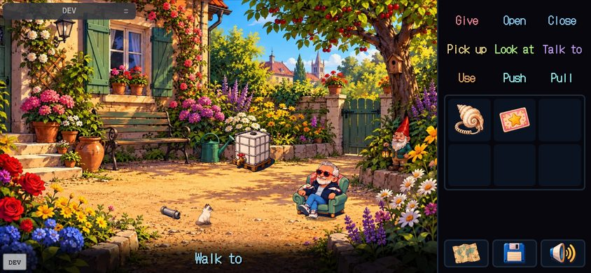<br><sub>Un lieu : neuf verbes, le sac, la scène</sub></td></tr>
<tr><td width="50%" valign="top"><br><sub>Sujets de conversation, transcription, une couleur par personnage</sub></td><td width="50%" valign="top"><br><sub>Un appel téléphonique à deux voix</sub></td></tr>
<tr><td width="50%" valign="top">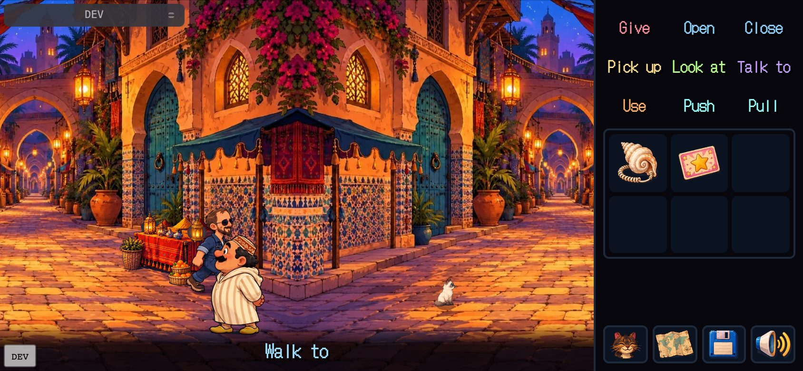<br><sub>Un lieu plus large que l'écran : la caméra suit le héros</sub></td><td width="50%" valign="top">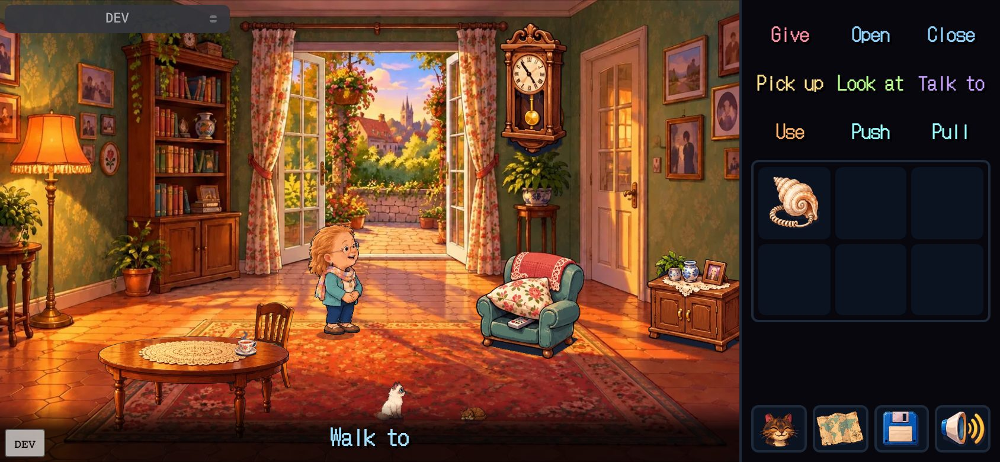<br><sub>Deux personnages jouables : le bouton en bas change de personnage, chacun a son sac</sub></td></tr>
<tr><td width="50%" valign="top"><br><sub>La carte du monde, avec véhicules et marqueurs « nouveau »</sub></td><td width="50%" valign="top"><br><sub>Un mini-jeu (tuyaux), la voix d'aide au-dessus</sub></td></tr>
<tr><td width="50%" valign="top"><br><sub>Choisir la bonne fleur</sub></td><td width="50%" valign="top"><br><sub>La fin scellée : un ticket à gratter</sub></td></tr>
<tr><td width="50%" valign="top"><br><sub>La carte finale juge le pronostic du joueur</sub></td><td width="50%" valign="top">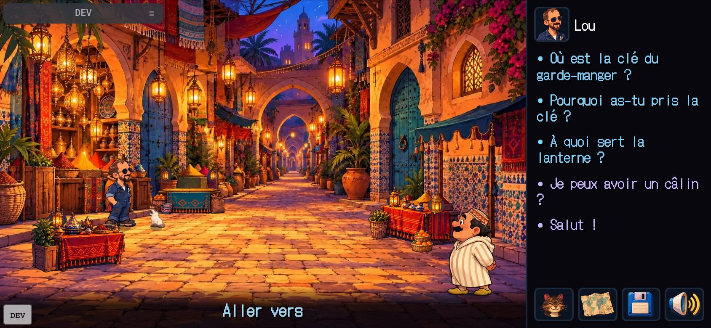<br><sub>Le même jeu en français : un fichier JSON, un réglage Langue</sub></td></tr>
<tr><td width="50%" valign="top">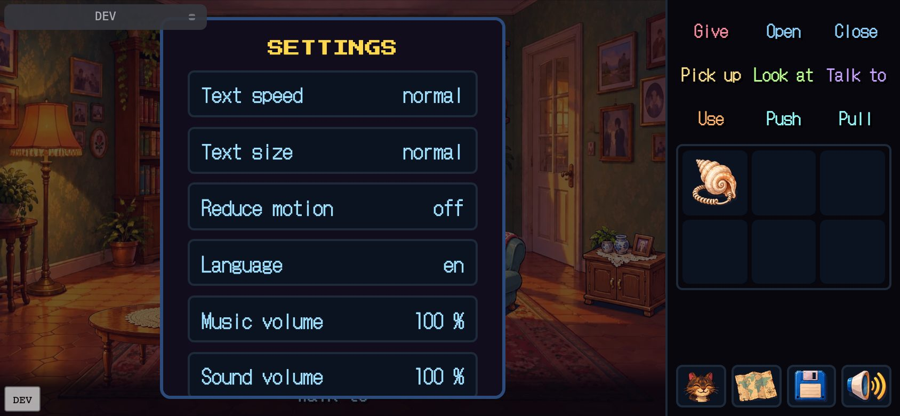<br><sub>Réglages : vitesse et taille du texte, mouvements réduits, police lisible, volumes</sub></td><td width="50%" valign="top">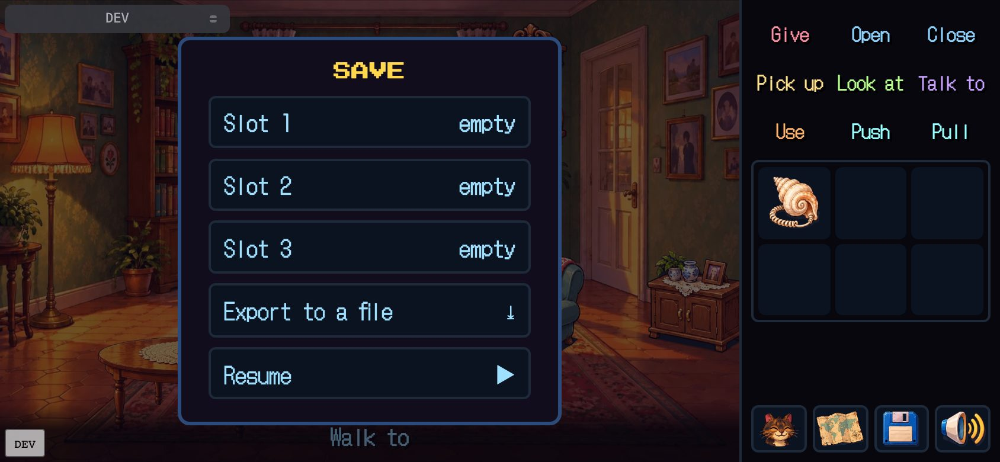<br><sub>Emplacements de sauvegarde, export dans un fichier, import</sub></td></tr>
</table>

## Le Studio

`npm run studio` ouvre un environnement de création local sur les fichiers du jeu ; `studio.html` sur le site de démo
est le même en mode démo (les modifications restent dans ton navigateur). Chaque onglet est un travail, dans l'ordre
où on les fait : écrire l'histoire, placer les lieux, générer les images, vérifier, jouer, prendre des notes avec
l'IA. Voir `docs/fr/STUDIO.md`.

<table>
<tr><td width="50%" valign="top">Rooms</b> : le lieu rendu par le vrai moteur, l'éditeur de placement par-dessus ; sélectionne n'importe quoi et modifie sur place ses lignes, ses réactions et ses sujets" width="100%"><br><sub><b>Rooms</b> : le lieu rendu par le vrai moteur, l'éditeur de placement par-dessus ; sélectionne n'importe quoi et modifie sur place ses lignes, ses réactions et ses sujets</sub></td><td width="50%" valign="top">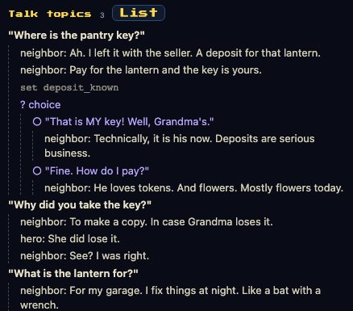Arbre de dialogue</b> : les sujets d'un personnage en arbre (répliques, choix, branches, conditions), dérivé du contenu ; toucher un nœud saute à son éditeur" width="100%"><br><sub><b>Arbre de dialogue</b> : les sujets d'un personnage en arbre (répliques, choix, branches, conditions), dérivé du contenu ; toucher un nœud saute à son éditeur</sub></td></tr>
<tr><td width="50%" valign="top">Storyboard</b> : l'histoire case par case, répliques, aperçu, notes ; la première chose à écrire" width="100%"><br><sub><b>Storyboard</b> : l'histoire case par case, répliques, aperçu, notes ; la première chose à écrire</sub></td><td width="50%" valign="top">Assets</b> : chaque planche et chaque case, où elle sert, le prompt à coller dans un modèle d'images, les envois découpés automatiquement" width="100%"><br><sub><b>Assets</b> : chaque planche et chaque case, où elle sert, le prompt à coller dans un modèle d'images, les envois découpés automatiquement</sub></td></tr>
<tr><td width="50%" valign="top">Un décor</b> avec ses zones, accessoires et bande de sol superposés" width="100%"><br><sub><b>Un décor</b> avec ses zones, accessoires et bande de sol superposés</sub></td><td width="50%" valign="top">Check</b> : validateur, chemin du solveur, carte du monde, graphe de puzzles et rapport de contenu, relancés après chaque enregistrement" width="100%"><br><sub><b>Check</b> : validateur, chemin du solveur, carte du monde, graphe de puzzles et rapport de contenu, relancés après chaque enregistrement</sub></td></tr>
<tr><td width="50%" valign="top">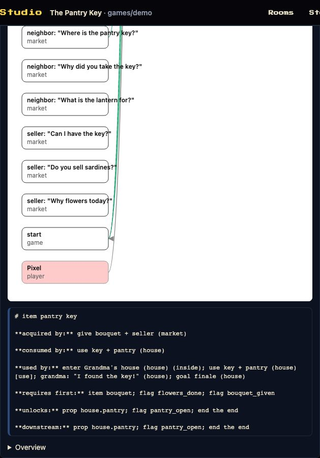Puzzles</b> : toucher un objet ou un flag affiche sa fiche : d'où il vient, ce qui en a besoin, ce qu'il débloque" width="100%"><br><sub><b>Puzzles</b> : toucher un objet ou un flag affiche sa fiche : d'où il vient, ce qui en a besoin, ce qu'il débloque</sub></td><td width="50%" valign="top">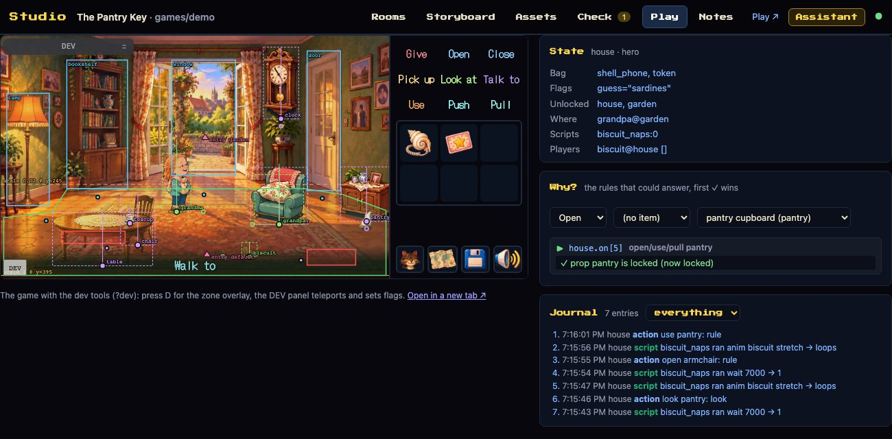Play</b> : le jeu à côté de son état en direct, un explicateur de règles (chaque condition ✓ / ✗) et le journal" width="100%"><br><sub><b>Play</b> : le jeu à côté de son état en direct, un explicateur de règles (chaque condition ✓ / ✗) et le journal</sub></td></tr>
<tr><td width="50%" valign="top">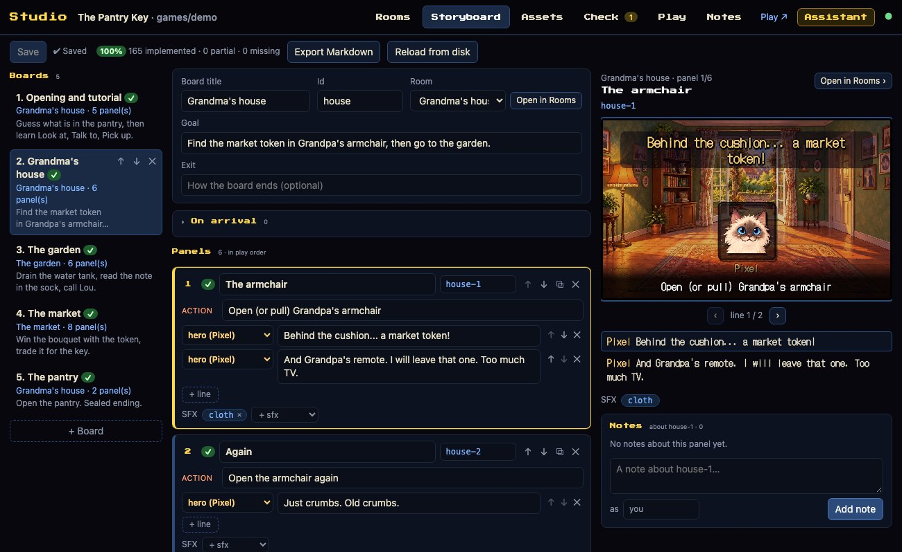Couverture du storyboard</b> : chaque board et chaque case confrontés au jeu ; ce que l'histoire dit et que le jeu ne fait pas encore est listé sous la case" width="100%"><br><sub><b>Couverture du storyboard</b> : chaque board et chaque case confrontés au jeu ; ce que l'histoire dit et que le jeu ne fait pas encore est listé sous la case</sub></td><td width="50%" valign="top">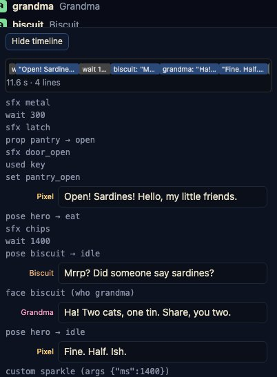Timeline de cinématique</b> : combien dure chaque réplique, marche et animation, ce qui tourne en parallèle, où l'on attend le joueur ; toucher une barre édite la ligne" width="100%"><br><sub><b>Timeline de cinématique</b> : combien dure chaque réplique, marche et animation, ce qui tourne en parallèle, où l'on attend le joueur ; toucher une barre édite la ligne</sub></td></tr>
<tr><td width="50%" valign="top">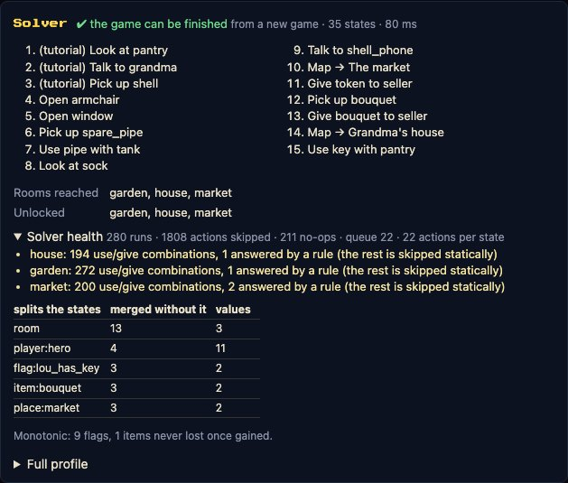Solver health</b> : de quoi les états sont faits, ce que la recherche a coûté, les avertissements qu'un auteur traite ; une carte de chaleur et le chemin critique sur le graphe de puzzles" width="100%"><br><sub><b>Solver health</b> : de quoi les états sont faits, ce que la recherche a coûté, les avertissements qu'un auteur traite ; une carte de chaleur et le chemin critique sur le graphe de puzzles</sub></td><td width="50%" valign="top">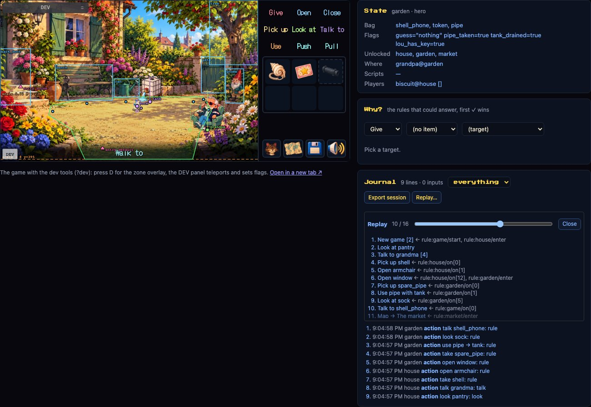Replay</b> : un fichier de session (le rapport de bug d'un testeur) parcouru au curseur dans l'onglet Play ; le jeu se pose là où tu t'arrêtes" width="100%"><br><sub><b>Replay</b> : un fichier de session (le rapport de bug d'un testeur) parcouru au curseur dans l'onglet Play ; le jeu se pose là où tu t'arrêtes</sub></td></tr>
<tr><td width="50%" valign="top">Notes</b> : le journal partagé entre toi et l'IA, à propos d'une case, d'un lieu ou d'un élément" width="100%"><br><sub><b>Notes</b> : le journal partagé entre toi et l'IA, à propos d'une case, d'un lieu ou d'un élément</sub></td><td width="50%" valign="top">Assistant</b> : n'importe quel modèle d'IA avec les mêmes outils que le serveur MCP, à propos de l'élément sélectionné" width="100%"><br><sub><b>Assistant</b> : n'importe quel modèle d'IA avec les mêmes outils que le serveur MCP, à propos de l'élément sélectionné</sub></td></tr>
<tr><td width="50%" valign="top">L'éditeur de placement</b> dans le jeu lui-même (<code>?edit=house</code>)" width="100%"><br><sub><b>L'éditeur de placement</b> dans le jeu lui-même (<code>?edit=house</code>)</sub></td><td width="50%" valign="top">La page de placement</b> : placer les choses depuis un téléphone, exporter le layout" width="100%"><br><sub><b>La page de placement</b> : placer les choses depuis un téléphone, exporter le layout</sub></td></tr>
</table>

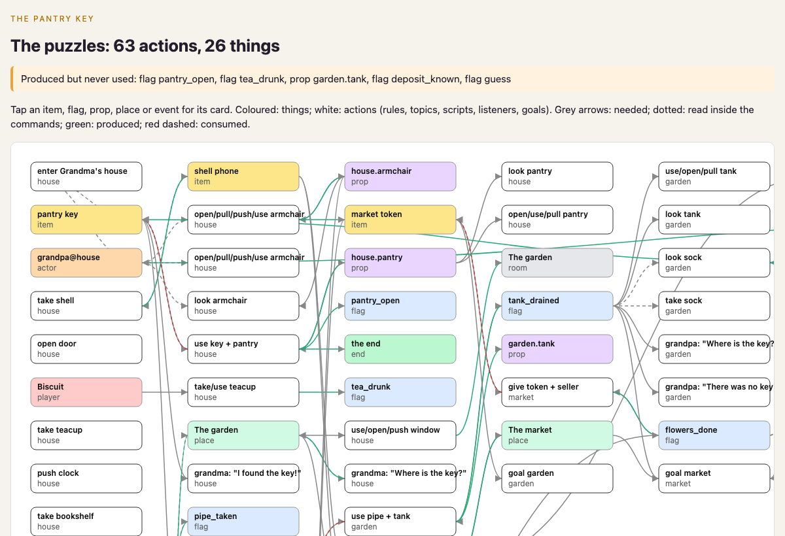
<sub>Le graphe de puzzles (`npm run page:puzzles`, aussi dans Check) : les choses en couleur, les actions en blanc ;
flèches grises pour ce qu'une action exige, vertes pour ce qu'elle produit, rouges pour ce qu'elle consomme. Toucher
une chose affiche sa fiche.</sub>

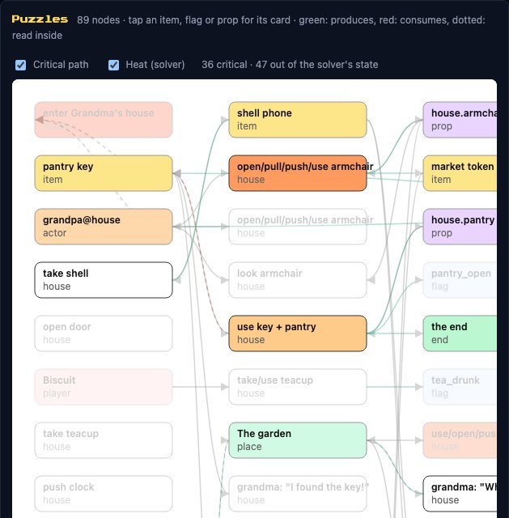<br>
<sub>Le même graphe avec **Critical path** et **Heat** : ce qui ne mène pas à la fin s'estompe, les règles par lesquelles
le solveur est le plus passé rougissent ; une fiche dit pourquoi le solveur garde une chose (critical, world, visible ou dead).</sub>

## Démarrer

Node 22+. Pour les outils d'images : Python 3 avec `pip install -r requirements.txt` (Pillow, NumPy, SciPy) et ffmpeg.

```bash
npm install
npm run dev          # le jeu d'exemple ; ouvre l'URL sur ton téléphone (même Wi-Fi), tiens-le en paysage
npm run studio       # le Studio sur /__studio/ : lieux, textes, storyboard, images, vérifications, jeu, notes
npm test             # 154 tests : moteur, outils, parcours du jeu d'exemple
```

Faire son propre jeu :

```bash
npm run new-game mon-jeu "Mon Jeu"   # games/mon-jeu depuis le modèle, défini comme jeu courant
npm run assets                       # prépare les images provisoires
npm run dev                          # ?edit=debut place les choses, ?dev&at=debut saute à un checkpoint
```

Puis écrire `games/mon-jeu/rooms/*.ts` avec `docs/fr/CONTENT_GUIDE.md` ouvert. L'histoire va d'abord dans
`storyboard.json` ; `docs/fr/WORKFLOW.md` est la méthode complète, pas à pas ; `docs/fr/DESIGN.md` explique comment en
faire un bon jeu.

## Comment un jeu s'écrit

Tout est données : lieux, accessoires à états, personnages, objets, règles, sujets de conversation, indices, scripts,
événements. Aucun code dans le contenu, donc chaque outil peut le lire, le vérifier et le jouer.

```ts
export const jardin: RoomDef = {
  id: 'garden', name: 'Le jardin', decor: 'garden',
  props: { tank: { name: 'citerne', states: { full: 'tank_full', empty: 'tank_empty' } } },
  actors: { grandpa: { char: 'grandpa' } },
  exits: { back_door: { name: 'porte de derrière', to: 'house', entry: 'garden' } },
  look: { tank: ['Une grande citerne. Pleine à ras bord.', 'Il y a quelque chose au fond.'] },
  on: [
    { verb: 'use', a: 'pipe', b: 'tank', if: '!tank_drained',
      do: [{ minigame: 'pipes', params: { /* ses tuiles : voir games/demo */ } }, { lose: 'pipe' }, { set: 'tank_drained' }, { prop: ['tank', 'empty'] }, { show: 'sock' }] },
  ],
  talk: { grandpa: [{ topic: 'Où est la clé ?', if: '!tank_drained', do: [{ say: ['grandpa', 'Tombée dans la citerne. Plouf.'] }] }] },
  scripts: [{ id: 'grandpa_naps', loop: true, do: [{ wait: 7000 }, { anim: ['grandpa', 'snore'], ms: 1200 }] }],
  hints: [{ until: 'tank_drained', lines: ['Utilise le tuyau sur la citerne.'] }],
};
```

Une règle, c'est un verbe, une cible, une condition et une liste de commandes. Les sujets se ramifient avec `choice`
et `if`. Les scripts tournent entre les actions du joueur ; les événements (`emit` / `events`) font réagir un lieu à
un autre. Les personnages changent de lieu, plusieurs peuvent être jouables, un lieu peut être plus large que l'écran.
Tout le vocabulaire est dans `src/engine/core/types.ts` ; `docs/fr/CLASSICS.md` montre vingt mécaniques célèbres
(combat d'insultes, chope qui fond, infirmière en ronde, marchandage, arbre planté dans le passé) écrites avec.

## Vérifier avant que quelqu'un y joue

```bash
npm run validate                   # références cassées, Regarder manquants, flags jamais posés, scripts qui n'attendent jamais…
npm run validate -- --report       # le profileur de contenu : ce que pèse chaque lieu, objet et personnage
npm run solve                      # joue chaque action depuis « Nouvelle partie » et imprime un chemin jusqu'à la fin
npm run solve -- --chapters        # une preuve bornée par chapitre (checkpoints avec goals), puis jusqu'à la fin
npm run page:puzzles               # le graphe de puzzles en page (aussi dans l'onglet Check du Studio)
npm run page:world                 # la carte du monde : sorties, gotos, lieux inaccessibles
```

Le solveur utilise le vrai moteur avec un écran muet : ce qu'il trouve, un joueur peut le faire. Il essaie chaque
réponse d'un choix, change de personnage jouable, fait avancer les scripts un wait à la fois, et laisse hors de l'état
ce qui ne peut pas changer l'issue (un flag que seul son poseur lit, une horloge que personne ne regarde) : un monde
plein de décoration ne lui coûte rien, un jeu généré de 100 salles et 5 joueurs est prouvé en huit secondes
(`docs/fr/BENCH.md`). Il signale les impasses, les objets jamais utilisés, les **invariants** devenus vrais, et le chemin
qui y mène.

## Les images

`npm run prompts` écrit des prompts prêts à coller pour chaque planche de personnage (marche, parole, assis, les
poses que tes lieux utilisent), chaque planche d'objet avec ses états, chaque décor et meuble, tous avec le même bloc
de style et les règles de couleur (quatre tons par matière, aplats, un seul contour). `artStyle: "pixel"` dans
`site.json` bascule prompts, découpe et rendu en vrai pixel art. `npm run assets` découpe les planches générées en
sprites et prépare décors, sons et voix (`docs/fr/PROMPTS.md`, `docs/fr/TOOLS.md`).

## Le son

`npm run audio` fait pour le son ce que les prompts font pour les images : une seule banque d'instruments Mega Drive
(`tools/audio/palette.json`) pour chaque morceau et chaque bruitage d'un jeu. Un MIDI que tu as le droit d'utiliser
(le tien, ou du domaine public : le thème du jeu d'exemple est le *Lac des cygnes* de Tchaïkovski) est analysé,
réorchestré pour les puces YM2612 et SN76489 à travers un `spec.json` que l'assistant écrit, rendu par Furnace et mesuré
par un rapport QA ; les bruitages sont de courtes recettes dans `audio/sfx.json` rendues depuis la même palette
(`docs/fr/AUDIO.md`).

## Avec une IA

Le contenu est données et chaque outil est une commande : un assistant peut écrire un lieu, le vérifier, le résoudre,
le regarder et le corriger sans toi. `CLAUDE.md` et `AGENTS.md` portent les règles ; `.claude/skills/` les recettes
(un nouveau lieu, une planche à découper) ; `npm run -s mcp` expose les mêmes opérations en 20 outils MCP pour Claude
Code, Cursor, Codex, Gemini CLI ou n'importe quel client MCP (`docs/fr/MCP.md`) ; l'onglet Assistant du Studio
branche n'importe quel modèle sur ces outils ; `docs/fr/WORKFLOW.md` est la méthode, `docs/fr/PRODUCTION.template.md`
le plan pour des sous-agents en parallèle.

```bash
npm run i18n -- extract --lang en    # une table de traduction (games/<id>/locales/en.json) qui survit aux refactors
npm run bench -- --rooms=40          # un jeu généré de cette taille, chaque outil chronométré dessus
npm run e2e                          # le jeu d'exemple joué dans Chromium, téléphone en paysage, avec captures
npm run build                        # types, tests, bundle, contrôle des spoilers, audit des noms privés → dist/
```

`npm run build` produit un `dist/` statique ; la CI le déploie sur GitHub Pages à chaque push sur `main`, avec le
Studio en mode démo sur `studio.html`. N'importe quel hébergement statique convient. `GAME=<id> npm run build`
construit un autre jeu.

## Versions

| Version | Ce qu'elle a ajouté |
|---|---|
| v2.5 Sound | La chaîne audio Mega Drive (`npm run audio`) : musique arrangée depuis un MIDI via `spec.json`, bruitages depuis `sfx.json`, une seule palette ; le jeu d'exemple reçoit un thème et des bruitages rendus par les puces. |
| v2.4 Author | Couverture du storyboard : des badges sur chaque board et chaque case, un panneau Check et l'outil `storyboard_coverage` ; la timeline de cinématique dans l'onglet Rooms. |
| v2.3 Replay | Sessions enregistrées et rejouées (`npm run replay`, onglet Play) ; la solution du solveur rejouée par la CI dans Chromium ; le profil du solveur et « Solver health » ; pourquoi une chose est live, le chemin critique et une carte de chaleur sur le graphe de puzzles ; réduction d'ordre partiel (`--por`) ; commandes custom contrôlées en dev. |
| v2.2 Studio | L'arbre de dialogue (onglet Rooms, outil MCP `dialogue_tree`) ; le journal du moteur (onglet Play, panneau dev). |
| v2.1 Proof | Les classiques (`CLASSICS.md`) ; le graphe de puzzles ; un solveur qui énumère les choix, garde les compteurs exacts, joue les scripts un wait à la fois et élague ce qui ne peut pas compter ; le bench de charge ; un seul catalogue des commandes vérifié par `tsc` ; des boucles avec sons d'image ; des traductions qui suivent les textes déplacés. |
| v2.0 Open | Commandes custom à effets déclarés ; traductions par extraction ; l'onglet Play et son explicateur de règles ; fixtures par primitive. |
| v1.6 Cast | Plusieurs personnages jouables (`players`, `switchPlayer`, `transfer`). |
| v1.5 Picture | Lieux larges et caméra ; animations d'accessoires à événements d'image ; voix ; le menu Réglages. |
| v1.4 Scale | Sorties déclarées et carte du monde ; chapitres et invariants ; emplacements de sauvegarde et migrations en données ; le profileur de contenu. |
| v1.3 World | Scripts, événements, personnages qui changent de lieu. |

Le raisonnement derrière chaque jalon est dans `docs/fr/ROADMAP.md`.

## Plan du dépôt

```
src/engine/      core (DSL, moteur, catalogue des commandes), tools (validate, solve, puzzle, graph, report, i18n, stress), dom (rendu), minigames, ending, dev (éditeur)
games/demo/      le jeu d'exemple : game.ts, rooms/, layout/, art/, audio/, locales/, storyboard.json, site.json
games/_template/ copié par npm run new-game
tools/           CLIs (validate, solve, i18n, bench, prompts), pages/, studio/, mcp/, assets.py, cut-sheet.py
scripts/         harnais e2e, seal (fin scellée), gen-icons, new-game
docs/en docs/fr  CONTENT_GUIDE, CLASSICS, DESIGN, ENGINE, TOOLS, STUDIO, MCP, PAGES, PROMPTS, WORKFLOW, BENCH, ROADMAP
```

## Licences

Code : MIT. Images, arrangement musical et bruitages du jeu d'exemple : CC BY 4.0 (attribution « Wano ») ; la musique est le *Lac des cygnes* de Tchaïkovski (domaine public). Polices : SIL OFL. Voir `CREDITS.md`.
