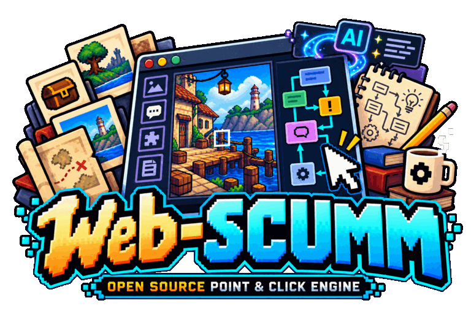
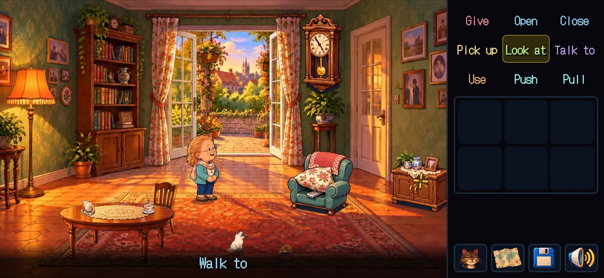
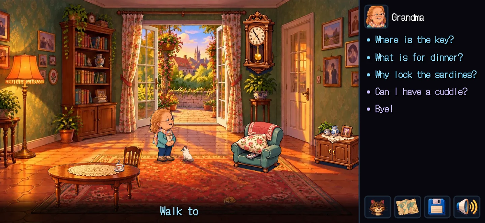
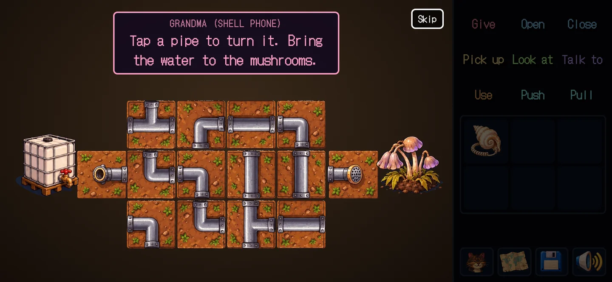
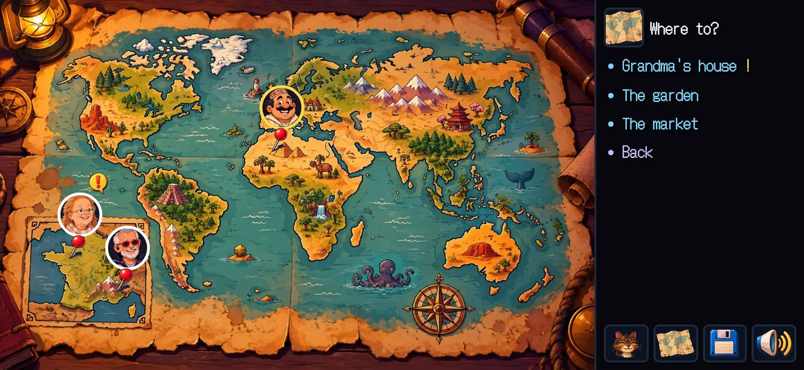
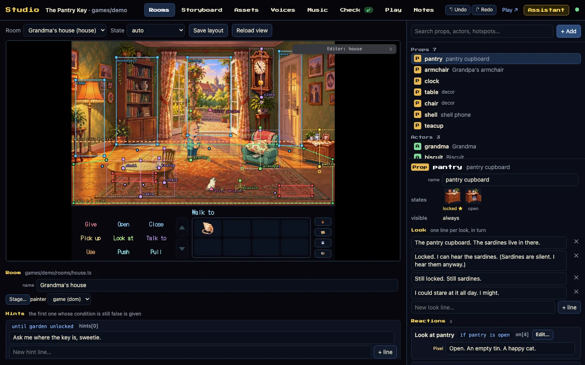
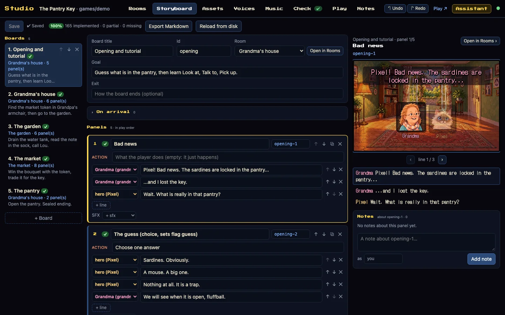
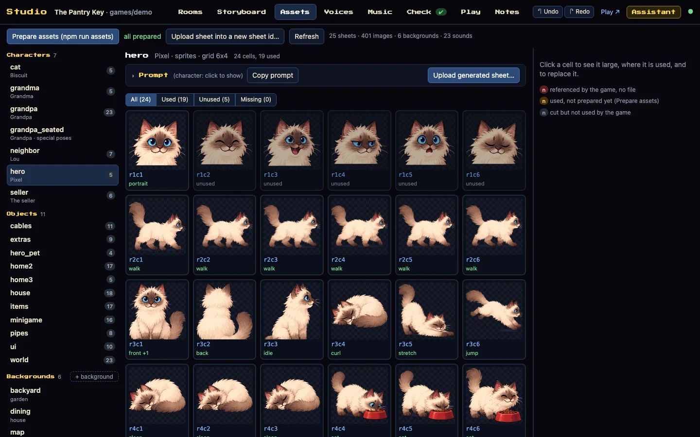
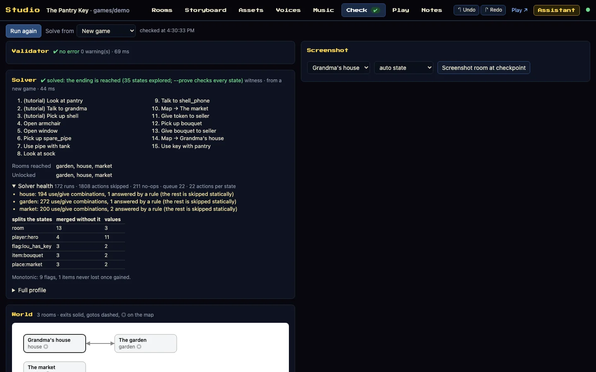
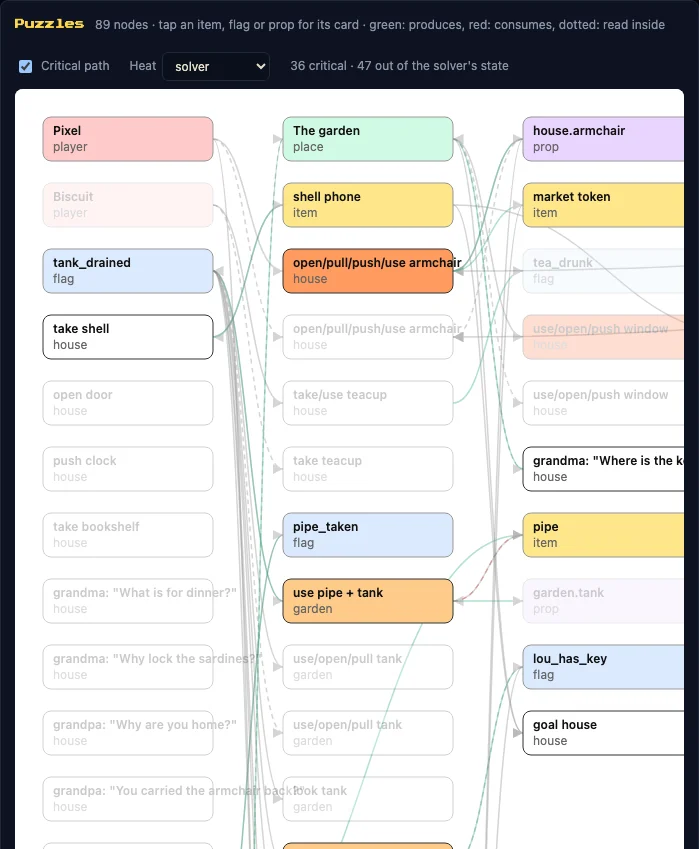

<p align="center"></p>

# web-scumm

**Write a point-and-click adventure as data, prove it can be finished, ship it to a phone.**

web-scumm is a SCUMM-style engine for the browser, a visual Studio to make the game, and a toolchain that checks the
content, proves every puzzle has a way out, and builds a web game that installs on a phone and plays offline. A game is
rooms, props, rules and lines, all plain data: a person writes it, an AI assistant writes it, a solver reads it.

*[Version française](README.fr.md)*

| | |
|---|---|
| 🎮 **Play** | [The Pantry Key](https://wanoo.github.io/web-scumm/), the sample game, on a phone in landscape or on a desktop |
| 🛠 **Studio** | [Open the Studio](https://wanoo.github.io/web-scumm/studio.html) in demo mode: edit the sample game, your edits stay in your browser |
| ⏱ **Start** | [A first room in fifteen minutes](docs/en/TUTORIAL.md), then [make your own game](#make-your-own-game) |
| 📚 **Docs** | [The method](docs/en/WORKFLOW.md) · [the content format](docs/en/CONTENT_GUIDE.md) · [every page](#documentation) |



## Three commands

```bash
npm install && npm run new-game lamp "The Lamp"   # a complete one-room game from the template
npm run dev                                       # play it; npm run studio opens the Studio next to it
npm run verify:game && npm run build              # checked, proved, built into dist/ for any static host
```

Needs Node 22.12 or newer. Python 3 and ffmpeg serve the art tools and the sound pipeline: optional, and `npm run
doctor` says which one is missing. Windows, macOS and Linux ([SUPPORT](docs/en/SUPPORT.md) has the matrix).

## What you get

| For | web-scumm gives |
|---|---|
| **The player** | nine classic verbs and a bag, dialogue with topics and choices, hints from a character, cutscenes and phone calls, rooms wider than the screen, several playable characters, seven minigames, an optional sealed ending, autosave and save slots, translations, settings, touch, mouse and keyboard, the whole game offline after the first visit |
| **The writer** | a storyboard first, then rooms, props with states, characters, items, rules, topics, hints, scripts and events, as data with no code in it; twenty famous mechanics of the genre written with it ([CLASSICS](docs/en/CLASSICS.md)) |
| **The artist** | a prompt for every sprite sheet, object and backdrop in one style, sheets cut into sprites, chip-tune music arranged from a MIDI and sound effects from one palette ([PROMPTS](docs/en/PROMPTS.md), [AUDIO](docs/en/AUDIO.md)) |
| **The studio** | a visual Studio over the real engine (rooms, storyboard, assets, checks, play, notes with an assistant), the same operations as MCP tools for any AI client, and a command line ([STUDIO](docs/en/STUDIO.md), [MCP](docs/en/MCP.md), [TOOLS](docs/en/TOOLS.md)) |
| **The release** | a validator for broken references and untranslated lines, a solver that proves a path to the ending and names every state where it is lost, saves that load across versions, the licence of every shipped file, what a phone has to download, real browsers on every change ([ENGINE](docs/en/ENGINE.md), [BENCH](docs/en/BENCH.md)) |
| **The outside** | a game can react to a fact from the world (an email answered, a webhook called) through a signed signal, without its content touching the network ([REALITY](docs/en/REALITY.md)) |

## What the player sees

<table>
<tr><td width="50%" valign="top"><br><sub>Conversations with topics, choices and a transcript</sub></td><td width="50%" valign="top"><br><sub>Minigames, playable by touch or keyboard</sub></td></tr>
<tr><td width="50%" valign="top"><br><sub>A world map, characters who move between places</sub></td><td width="50%" valign="top"><br><sub>An ending that remembers what the player guessed</sub></td></tr>
</table>

## What the author sees

<table>
<tr><td width="50%" valign="top"><br><sub><b>Rooms</b>: the real engine, a placement editor on top, every line editable in place</sub></td><td width="50%" valign="top"><br><sub><b>Storyboard</b>: the story panel by panel, checked against the game</sub></td></tr>
<tr><td width="50%" valign="top"><br><sub><b>Assets</b>: every sheet and cell, where it is used, the prompt to make it</sub></td><td width="50%" valign="top"><br><sub><b>Check</b>: the validator and the solver, run again after every save</sub></td></tr>
</table>



The puzzle graph shows what each item, flag and room leads to. With **Critical path** on, what does not lead to the
end fades. With **Heat**, the rules the solver went through most turn red. The Studio also has a Play tab with a rule
explainer and session replay, shared notes with the AI, and an Assistant that works with any model.

<br clear="right">

## How a game is written

Everything is data: rooms, props with states, characters, items, rules, topics, hints, scripts, events. There is no
code in the content, so every tool can read it, check it and play it.

```ts
export const garden: RoomDef = {
  id: 'garden', name: 'The garden', decor: 'garden',
  props: { tank: { name: 'water tank', states: { full: 'tank_full', empty: 'tank_empty' } } },
  actors: { grandpa: { char: 'grandpa' } },
  exits: { back_door: { name: 'back door', to: 'house', entry: 'garden' } },
  on: [
    { verb: 'use', a: 'pipe', b: 'tank', if: '!tank_drained',
      do: [{ minigame: 'pipes', params: { /* see games/demo */ } }, { lose: 'pipe' }, { set: 'tank_drained' }, { prop: ['tank', 'empty'] }] },
  ],
  talk: { grandpa: [{ topic: 'Where is the key?', if: '!tank_drained', do: [{ say: ['grandpa', 'It fell in the tank. Plop.'] }] }] },
  hints: [{ until: 'tank_drained', lines: ['Use the pipe on the water tank.'] }],
};
```

A rule is a verb, a target, a condition and a list of commands. The solver plays these rules the way the engine does,
which is why it can prove the game: the same `Engine`, the same `resolve`, no second model of the content.

## Why an AI can really work on it

- The content is declarative, so an assistant reads and writes it like any other file; `AGENTS.md` holds the rules.
- Every operation is a command, and the same operations are MCP tools for Claude Code, Cursor, Codex, Gemini CLI or
  any MCP client ([MCP](docs/en/MCP.md)). The Studio's Assistant gives them to any model.
- After each change the assistant can validate, solve, replay a session and take a screenshot, so it sees its own
  mistakes before a person does. Every result stays reviewable, in the Studio and in Git.

## Make your own game

**In its own project** ([PACKAGE](docs/en/PACKAGE.md)): the engine installs from a release's tarball (npm publishing
is planned for 4.2, then `npx create-web-scumm my-game`):

```bash
T=https://github.com/wanoo/web-scumm/releases/download/v4.1.17/web-scumm-4.1.17.tgz
npx --package=$T web-scumm create my-game "My Game" --engine=$T
cd my-game && npm install
npm run assets && npm run dev        # then npm run verify, npm run build, npm run release
```

**In this repository**, beside the sample games:

```bash
npm install
npm run doctor                       # Node and Chromium required; Python modules, ffmpeg, Firefox, WebKit optional
npm run new-game my-game "My Game"   # games/my-game from the template, set as the current game
npm run assets                       # prepares the placeholder art
npm run studio                       # the Studio: rooms, story, assets, checks, play
```

Then, before anyone plays it: `npm run verify:game` (validation, a path to the ending, chapters, translations, lint,
playtests), `npm run prove:game` (every reachable state: softlocks and truncation fail), `npm run build` (type check,
tests, bundle and audits, into `dist/` for any static host). `npm run dev` plays your game on this computer,
`npm run dev:lan` on your phone. [TUTORIAL](docs/en/TUTORIAL.md) walks the first room; [WORKFLOW](docs/en/WORKFLOW.md)
is the whole method.

## In numbers

Measured on this commit of `main`, by the automated gates that run on every change (`npm run quality:baseline` writes
the three figures from `tests/quality-baseline.json`):

| What | Result |
|---|---|
| Unit tests | <!-- metric:tests -->1689<!-- /metric --> declarations, in Node 22 and 24, with coverage floors per module and mutation testing on what a save, a session, a condition and a signal rest on |
| Browser tests | the sample game played to its ending by touch and by keyboard in Chromium and WebKit at a phone's size, in English and French, with the DOM and the Canvas painter; a second game and the reference game too; every minigame won at the keyboard; axe-core on every screen |
| Saves | one frozen save per release from 3.0.0 to 4.1.17 loads and reaches the ending |
| Proof | the sample game's every reachable state in seconds; a 40-room reference game in <!-- metric:referenceStates -->288<!-- /metric --> states; 500 random games of each of three kinds compared to an explicit search every night, 0 divergences ([BENCH](docs/en/BENCH.md)) |
| A new game | packed, created from the tarball, installed, verified, built and played to its end by CI; a game made on the previous release upgraded and its save played to the end |
| The player's first visit | <!-- metric:initialJsKB -->133<!-- /metric --> KB of JavaScript, gzipped, held by a budget; every byte fetched predicted by the asset graph |
| The release | built from the commit CI tested, every file accounted for with its licence, SBOM, SHA-256 sums and a provenance attestation, never replaced once published |

What only people and real devices can check is listed, not claimed: [FIELD](docs/en/FIELD.md), and each release's
notes say which passes were made.

## Documentation

| Read | For |
|---|---|
| [TUTORIAL](docs/en/TUTORIAL.md) · [WORKFLOW](docs/en/WORKFLOW.md) | a first room in fifteen minutes; the method from the first idea to the release |
| [CONTENT_GUIDE](docs/en/CONTENT_GUIDE.md) · [CLASSICS](docs/en/CLASSICS.md) · [DESIGN](docs/en/DESIGN.md) | writing content, famous mechanics, making it a good game |
| [STUDIO](docs/en/STUDIO.md) · [TOOLS](docs/en/TOOLS.md) · [MCP](docs/en/MCP.md) | the Studio, every command, the AI tools |
| [ENGINE](docs/en/ENGINE.md) · [BENCH](docs/en/BENCH.md) · [FIELD](docs/en/FIELD.md) | how the engine works, what the proof can and cannot do, what only people and real devices check |
| [PROMPTS](docs/en/PROMPTS.md) · [AUDIO](docs/en/AUDIO.md) · [PAGES](docs/en/PAGES.md) | images, sound, the review pages |
| [REALITY](docs/en/REALITY.md) · [REALITY-OPS](docs/en/REALITY-OPS.md) | a game that reacts to the world outside, and how to run its Bridge |
| [PACKAGE](docs/en/PACKAGE.md) · [API](docs/en/API.md) · [SUPPORT](docs/en/SUPPORT.md) | a game in its own project, the public API with its signatures, what stays stable and on which platforms |
| [ARCHITECTURE](docs/en/ARCHITECTURE.md) · [CODE_TOUR](docs/en/CODE_TOUR.md) · [CONTRIBUTING](CONTRIBUTING.md) | how the code is put together, a half-hour tour of it, how to change it (and the decisions in `docs/dev/adr/`) |
| [ROADMAP](docs/en/ROADMAP.md) · [CHANGELOG](CHANGELOG.md) · [UPGRADING](docs/en/UPGRADING.md) | where it comes from, every release, moving to a new version |

Every page also exists in French under `docs/fr/`, and a test keeps the two in step. `docs/dev/` is the work log.

## Releases

Current release: [v4.1.17 "Stabilization"](https://github.com/wanoo/web-scumm/releases/tag/v4.1.17): no new mechanic,
the truth made green before the tag. A tag stands on a candidate run that passed, on its exact commit, the heavy solver
suite three times, the Bridge's load on SQLite and Postgres, four runtimes and five gated mutation sets; the release
publishes that run's files. A leaderboard never loses a faster run, the queue's room and quota hold for every
instance, the code wheel's result is computed again from its answers, and each trust level says what it proves. On
4.1.16's convergence (a run bound to its world, durable leaderboards), 4.1.15's worlds,
4.1.14's runs and proofs, 4.1.13's solver, 4.1.12's game-as-data, 4.1.11's scene frame, 4.1.10's durable Bridge,
4.1.9's connectors and 4.1.8's foundation.
From 4.1.1 to 4.1.7 every release added only what was optional, and a game written against one ran on the next;
from 4.1.8 the 4.1.x line is an incubation line, where a release may break a public name or a format, documented
and with a migration, until 4.2.0 restores strict SemVer ([SUPPORT](docs/en/SUPPORT.md)). The story
from v1.3 to here is in the [ROADMAP](docs/en/ROADMAP.md), every change in the [CHANGELOG](CHANGELOG.md).

## Repository map

```
src/engine/      core (the DSL, the engine), tools (validate, solve, lint, i18n…), dom (the player), minigames, reality
games/demo/      the sample game: rooms, layouts, art, audio, locales, storyboard
games/_template/ copied by npm run new-game
tools/           the commands, the Studio, the MCP server, the art and audio pipelines, the Vite plugins
bridge/          the Reality Bridge (the package web-scumm-bridge)
scripts/         the browser tests, the sealed ending, new-game, the README screenshots
docs/en docs/fr  the documentation; docs/dev: the work log, the decisions, each release's passes
```

The images of this page come from the production bundle and the Studio, taken by `npm run docs:screenshots`.

## Licences

Code: MIT. Sample artwork, sound effects and theme: CC BY 4.0 (attribution "Wano"); the theme is Tchaikovsky's *Swan
Lake* (public domain), written out and arranged for the project, so the sample game passes `npm run verify:commercial`.
Fonts: SIL OFL. See `CREDITS.md`.

web-scumm is an independent project. "SCUMM-style" names a kind of game; the project is not affiliated with, endorsed
by or derived from LucasArts, Lucasfilm, Disney or the ScummVM project, and ships none of their code, data or art.
