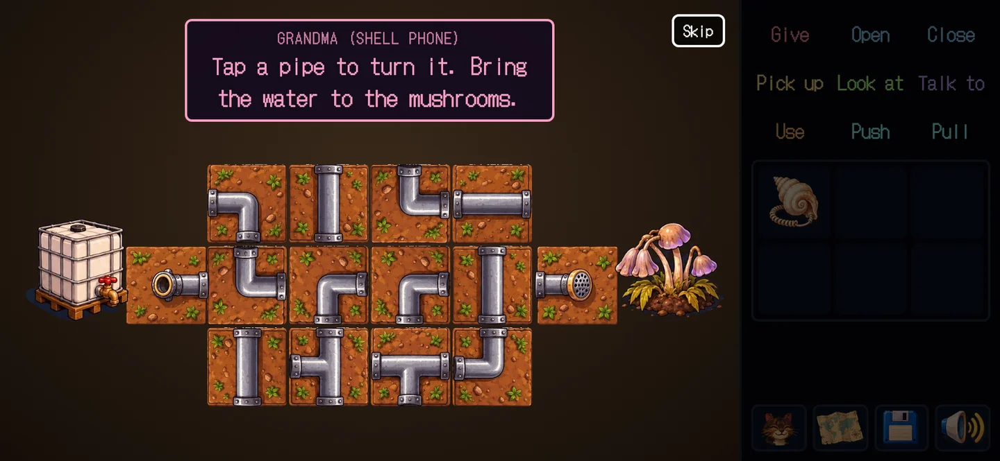
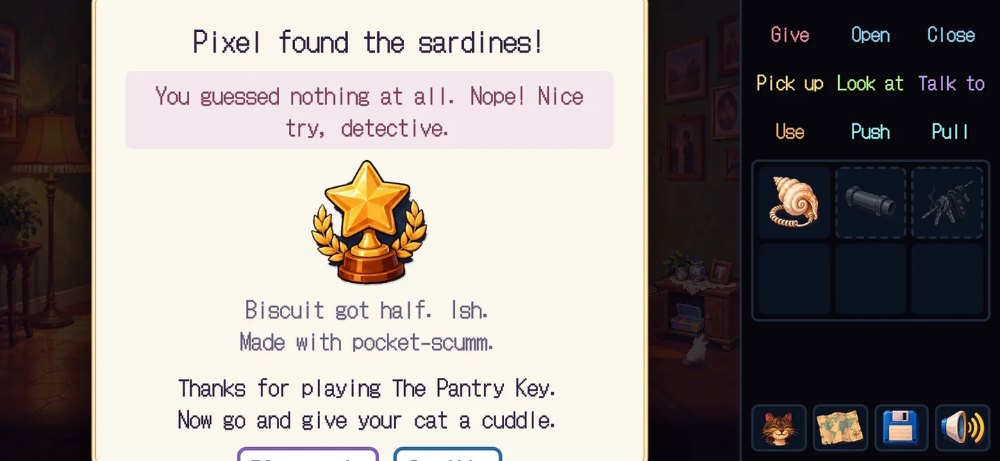
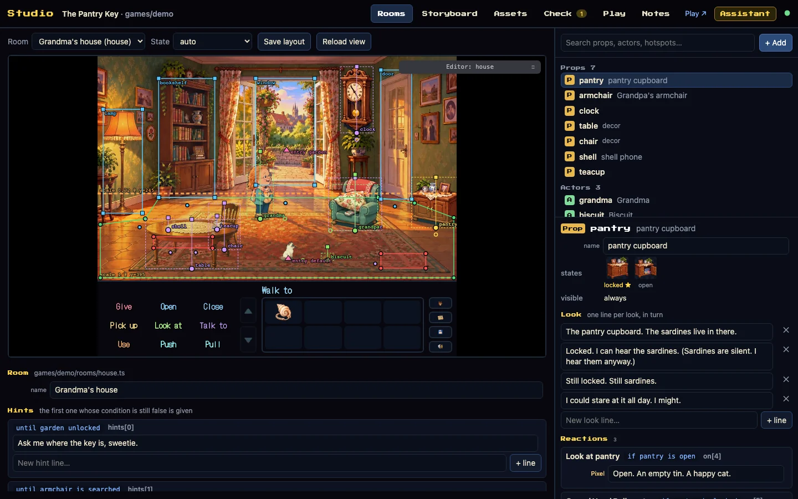
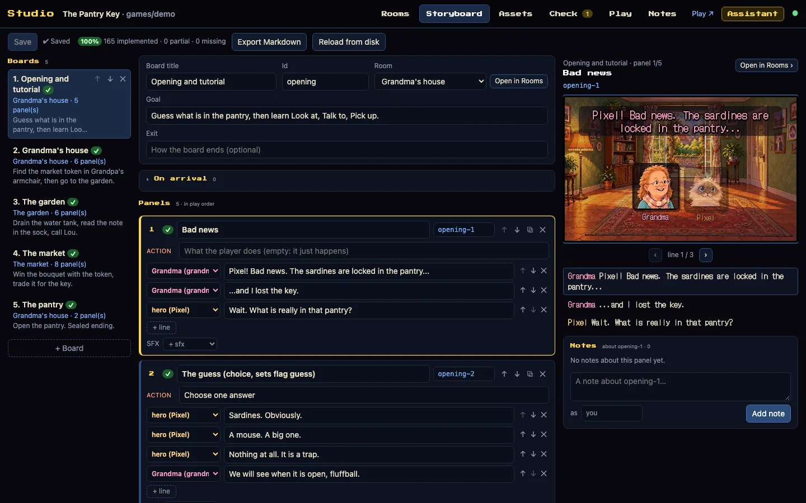
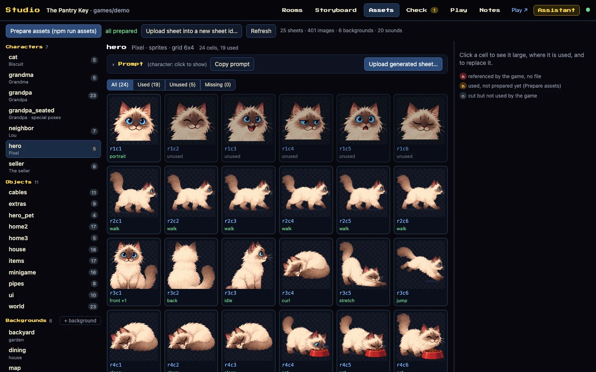
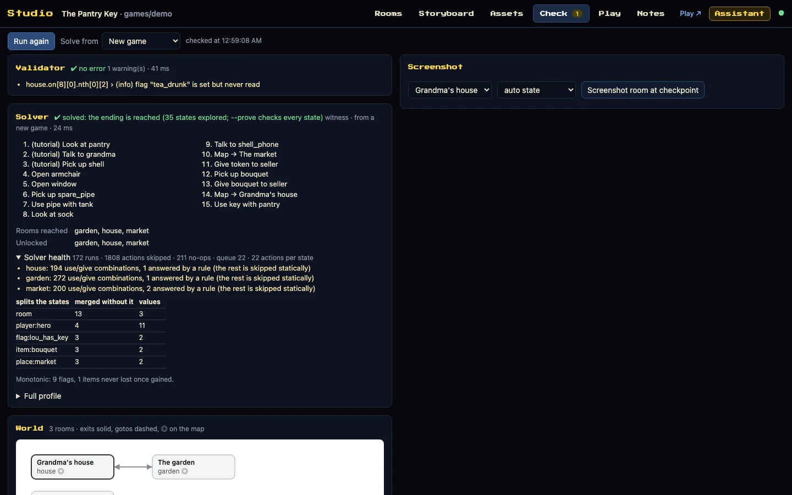
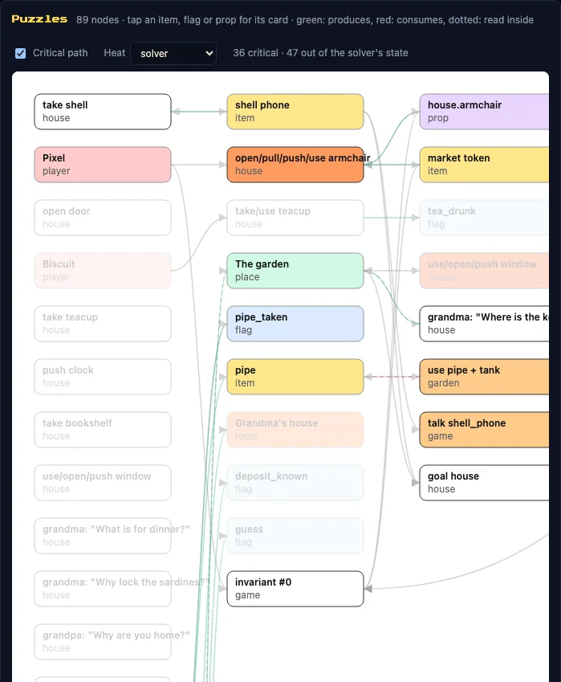

# web-scumm

**Build a complete point-and-click adventure with an AI, and prove it can be finished.**

A SCUMM-style engine made for phones, a visual Studio to produce the game, and a pipeline that checks it, proves it and
ships it as a web game that works offline. It started as the engine of a 9-room family game, written and shipped in a
single day with an AI assistant.

*[Version française](README.fr.md)*

| | |
|---|---|
| 🎮 **Play** | [The Pantry Key](https://wanoo.github.io/web-scumm/), the sample game: phone in landscape, or desktop |
| 🛠 **Studio** | [Open the Studio](https://wanoo.github.io/web-scumm/studio.html) in demo mode: your edits stay in your browser |
| 🚀 **Start** | [Make your own game](#make-your-own-game) in a few commands |
| 📚 **Docs** | [The method](docs/en/WORKFLOW.md) · [the content format](docs/en/CONTENT_GUIDE.md) · [all the docs](#documentation) |


**New in v3.3 "Scale":** games with several playable characters are proved, not just played. A 40-room reference
adventure with three characters, structured by eras (each character keeps to their own, items pass between them through
controlled passages), is checked state by state in 3.5 seconds
([how it is measured](docs/en/BENCH.md#330-measured-on-the-release-5-october-2026-cache-off)).

## More than an engine

| Step | What web-scumm gives you |
|---|---|
| **Write** | A storyboard first, then rooms, dialogue with choices, hints and rules, all as plain data. |
| **Build** | Rooms placed by dragging, characters cut from generated sprite sheets, prompts for every image, chip-tune music and sound effects. |
| **Check** | Broken references, untranslated lines, the licence of every shipped file, what a phone has to download. |
| **Prove** | A path to the ending, every state where the ending is lost and why, saves that load across versions, real browsers. |
| **Ship** | A static web game that installs on a phone, plays offline, on touch, mouse or keyboard. |

## v3.3 in numbers

Measured on the release, proof cache off ([BENCH.md](docs/en/BENCH.md)):

| What | Result |
|---|---|
| Reference game, 40 rooms × 3 characters, structured by eras | proved in 578 states, 3.5 s |
| The sample game, every reachable state | proved in 2.2 s, then 0.17 s from the proof cache |
| The sample game, chapter by chapter | proved in 3.3 s |
| The 7 bundled minigames | each one won with the keyboard alone, in Chromium and WebKit |
| Accessibility | tested at the keyboard, no serious or critical axe-core violation on any screen checked (not a WCAG claim) |
| Shipped assets | every file's hash and licence locked after review; weight budgets per room and chapter |

The proof explores the game as the engine plays it and assumes the minigames are won. The reference game keeps each
character in their own era. When items can move freely between three characters, the search still stops before the
end, and BENCH.md says so.

## What the player gets

<table>
<tr><td width="50%" valign="top"><br><sub>Conversations with topics, choices and a transcript</sub></td><td width="50%" valign="top"><br><sub>Minigames, playable by touch or keyboard</sub></td></tr>
<tr><td width="50%" valign="top"><br><sub>A world map, characters who move between places</sub></td><td width="50%" valign="top"><br><sub>An ending that remembers what the player guessed</sub></td></tr>
</table>

Nine classic verbs and a bag, dialogue, hints from a character, cutscenes and phone calls, rooms wider than the screen,
several playable characters with their own bags, scripts and events, seven minigames, an optional sealed ending,
autosave and save slots, translations, settings, touch, mouse and keyboard, and the whole game offline after the first
visit.

## What the author gets

<table>
<tr><td width="50%" valign="top"><br><sub><b>Rooms</b>: the real engine, a placement editor on top, every line editable in place</sub></td><td width="50%" valign="top"><br><sub><b>Storyboard</b>: the story panel by panel, checked against the game</sub></td></tr>
<tr><td width="50%" valign="top"><br><sub><b>Assets</b>: every sheet and cell, where it is used, the prompt to make it</sub></td><td width="50%" valign="top"><br><sub><b>Check</b>: the validator and the solver, run again after every save</sub></td></tr>
</table>



The puzzle graph shows what each item, flag and room leads to. With **Critical path** on, what does not lead to the
end fades. With **Heat**, the rules the solver went through most turn red. The Studio also has a Play tab with a rule
explainer and session replay, shared notes with the AI, and an Assistant that works with any model.

<br clear="right">

## Make your own game

Needs Node 22+, Python 3 for the art tools (`pip install -r requirements.txt`) and ffmpeg for sound.

```bash
npm install
npm run doctor                       # checks Node, Python modules, ffmpeg and the test browsers
npm run new-game my-game "My Game"   # games/my-game from the template, set as the current game
npm run assets                       # prepares the placeholder art
npm run studio                       # the Studio: rooms, story, assets, checks, play
```

Then, before anyone plays it:

```bash
npm run verify:game   # validation, a path to the ending, chapters, translations, lint, playtests
npm run prove:game    # every reachable state: softlocks and truncation fail
npm run build         # tests, bundle and audits, into dist/ for any static host
```

`npm run dev` plays your game on this computer, `npm run dev:lan` on your phone. Write the story in
`storyboard.json` first, then the rooms with [CONTENT_GUIDE](docs/en/CONTENT_GUIDE.md) open.
[WORKFLOW](docs/en/WORKFLOW.md) is the whole method, step by step.

## How a game is written

Everything is data: rooms, props with states, characters, items, rules, topics, hints, scripts, events. There is no
code in the content, so every tool can read it, check it and play it.

```ts
export const garden: RoomDef = {
  id: 'garden', name: 'The garden', decor: 'garden',
  props: { tank: { name: 'water tank', states: { full: 'tank_full', empty: 'tank_empty' } } },
  actors: { grandpa: { char: 'grandpa' } },
  exits: { back_door: { name: 'back door', to: 'house', entry: 'garden' } },
  on: [
    { verb: 'use', a: 'pipe', b: 'tank', if: '!tank_drained',
      do: [{ minigame: 'pipes', params: { /* see games/demo */ } }, { lose: 'pipe' }, { set: 'tank_drained' }, { prop: ['tank', 'empty'] }] },
  ],
  talk: { grandpa: [{ topic: 'Where is the key?', if: '!tank_drained', do: [{ say: ['grandpa', 'It fell in the tank. Plop.'] }] }] },
  hints: [{ until: 'tank_drained', lines: ['Use the pipe on the water tank.'] }],
};
```

A rule is a verb, a target, a condition and a list of commands. [CLASSICS](docs/en/CLASSICS.md) writes twenty famous
mechanics of the genre with it: insult sword fighting, a nurse on patrol, a tree planted in the past.

## Why an AI can really work on it

- The content is declarative, so an assistant reads and writes it like any other file.
- Every operation is a command, and the same operations are MCP tools for Claude Code, Cursor, Codex, Gemini CLI or
  any MCP client ([MCP](docs/en/MCP.md)). The Studio's Assistant gives them to any model.
- After each change the assistant can validate, solve, replay and take a screenshot, so it sees its own mistakes.
- Every result stays reviewable by a person, in the Studio and in Git. `CLAUDE.md` and `AGENTS.md` hold the rules.

## Art and sound

`npm run prompts` writes ready-to-paste image prompts for every character sheet, object, background and piece of
furniture, all in one style. `npm run assets` cuts the generated sheets into sprites ([PROMPTS](docs/en/PROMPTS.md)).
`npm run audio` arranges a MIDI for Mega Drive chips and renders the sound effects from the same palette
([AUDIO](docs/en/AUDIO.md)).

## Documentation

| Read | For |
|---|---|
| [WORKFLOW](docs/en/WORKFLOW.md) | the method, from the first idea to the release |
| [CONTENT_GUIDE](docs/en/CONTENT_GUIDE.md) · [CLASSICS](docs/en/CLASSICS.md) · [DESIGN](docs/en/DESIGN.md) | writing content, famous mechanics, making it a good game |
| [STUDIO](docs/en/STUDIO.md) · [TOOLS](docs/en/TOOLS.md) · [MCP](docs/en/MCP.md) | the Studio, every command, the AI tools |
| [ENGINE](docs/en/ENGINE.md) · [BENCH](docs/en/BENCH.md) | how the engine works, what the proof can and cannot do |
| [PROMPTS](docs/en/PROMPTS.md) · [AUDIO](docs/en/AUDIO.md) · [PAGES](docs/en/PAGES.md) | images, sound, the review pages |
| [ROADMAP](docs/en/ROADMAP.md) · [CHANGELOG](CHANGELOG.md) · [UPGRADING](docs/en/UPGRADING.md) | where it comes from, every release, moving to a new version |

Every page also exists in French under `docs/fr/`. `docs/dev/` holds the log of the work with the other assistant.

## Releases

Current release: [v3.3.1 "Truth"](https://github.com/wanoo/web-scumm/releases/tag/v3.3.1), a patch of v3.3 "Scale". The
story from v1.3 to v3.3 is in the [ROADMAP](docs/en/ROADMAP.md), every change in the [CHANGELOG](CHANGELOG.md).

## Repository map

```
src/engine/      core (the DSL, the engine), tools (validate, solve, lint, i18n…), dom (the renderer), minigames
games/demo/      the sample game: rooms, layouts, art, audio, locales, storyboard
games/_template/ copied by npm run new-game
tools/           the commands, the Studio, the MCP server, the art pipeline
scripts/         the browser tests, the sealed ending, new-game, the README screenshots
docs/en docs/fr  the documentation; docs/dev: the work log
```

The images of this page come from the production bundle and the Studio, taken by `npm run docs:screenshots`.

## Licences

Code: MIT. Sample artwork and sound effects: CC BY 4.0 (attribution "Wano"). The sample theme (Tchaikovsky's *Swan
Lake*, public domain) is arranged from a [classicals.de](https://www.classicals.de) transcription, CC BY-NC 4.0:
non-commercial, to replace in a commercial game. Fonts: SIL OFL. See `CREDITS.md`.
