# web-scumm

A SCUMM-style point-and-click adventure engine for phones, with the authoring tools and the AI-assisted workflow that
shipped a complete 9-room family game in a single day. Write your story as data, place things by dragging, prove the
game can be finished, play it in landscape on any phone, offline after the first visit.

*[Version française](README.fr.md)*

| | |
|---|---|
| 🎮 **Play the sample game** | https://wanoo.github.io/web-scumm/ (phone in landscape, or desktop) |
| 🛠 **Try the Studio** | https://wanoo.github.io/web-scumm/studio.html (demo mode: edits stay in your browser) |
| 📦 **Source** | https://github.com/wanoo/web-scumm · release v2.2.0 |

## In pictures

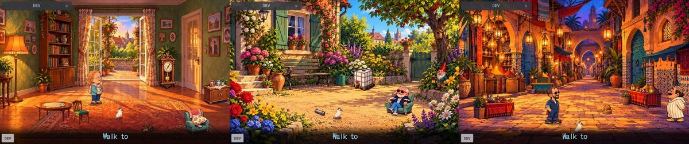

| | |
|---|---|
| 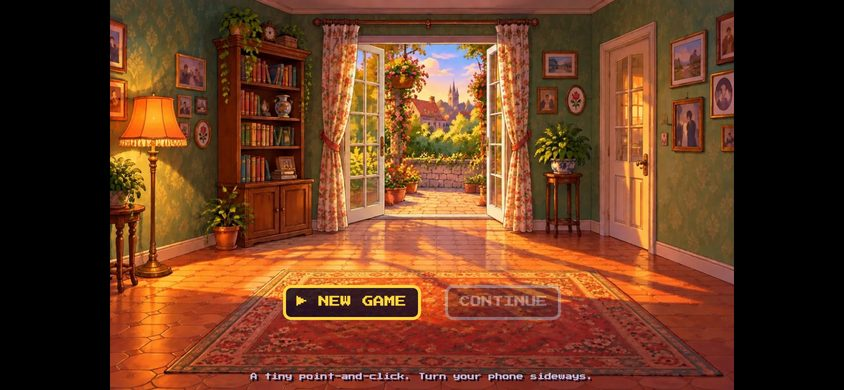 *Title screen, phone in landscape* | 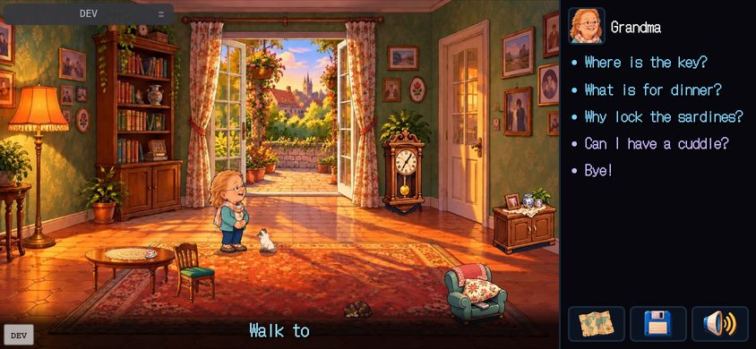 *Talk topics, transcript, speech colours per character* |
| 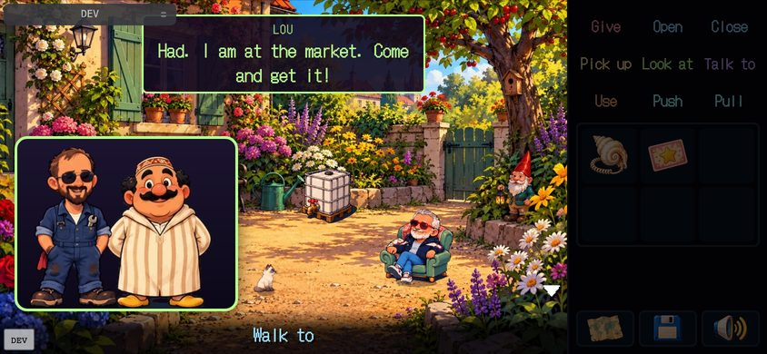 *A two-voice phone call* | 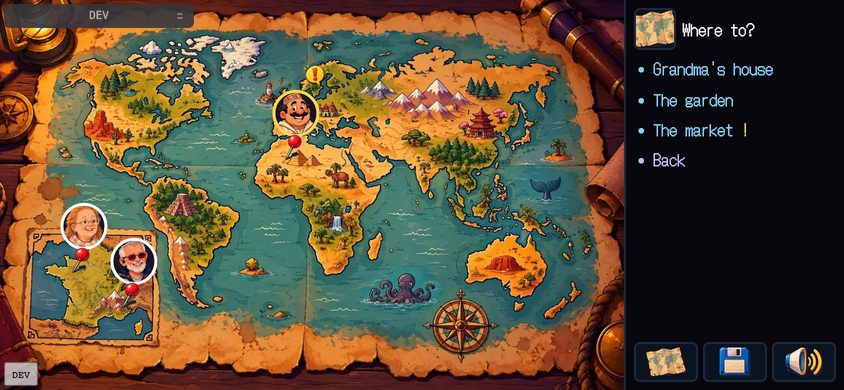 *The map, with vehicles and "news" markers* |
| 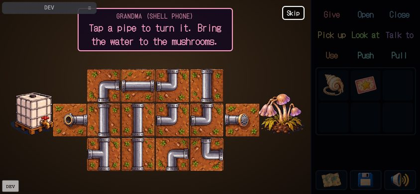 *Pipes minigame, hint voice on top* | 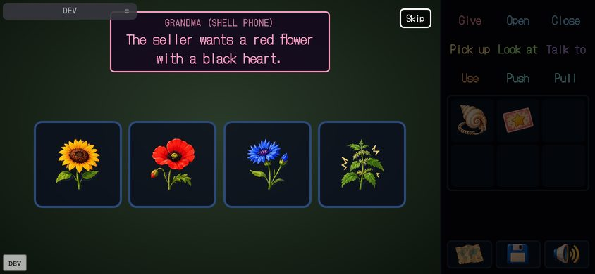 *Pick the right flower* |
| 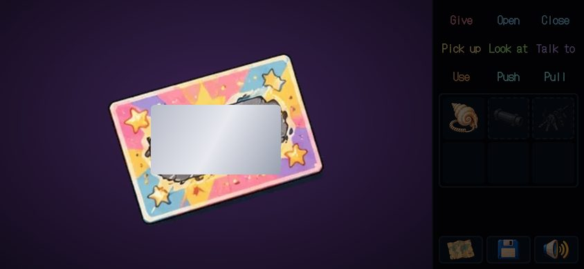 *The sealed ending: a ticket to scratch* | 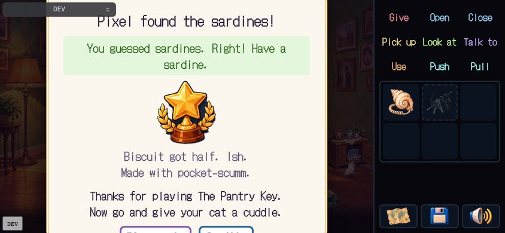 *The final card judges the player's guess* |
| 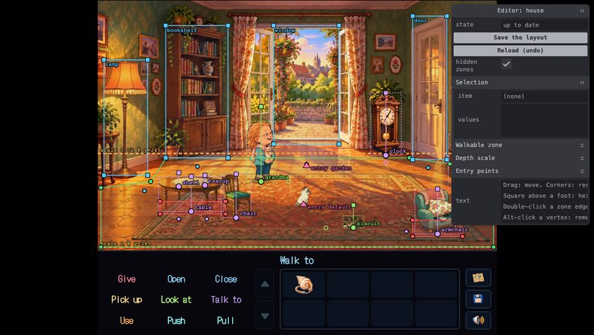 *The in-browser placement editor (`?edit=house`)* | 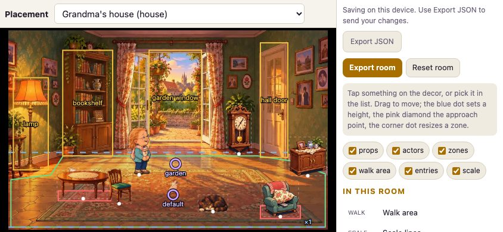 *The phone-friendly placement page* |
| 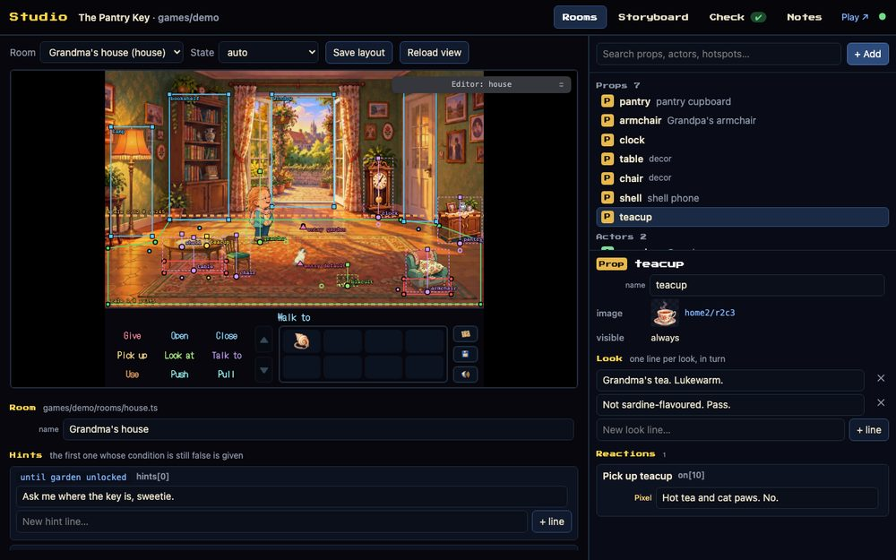 *The Studio, Rooms tab: the real engine, the element's sheet, texts edited in place* | 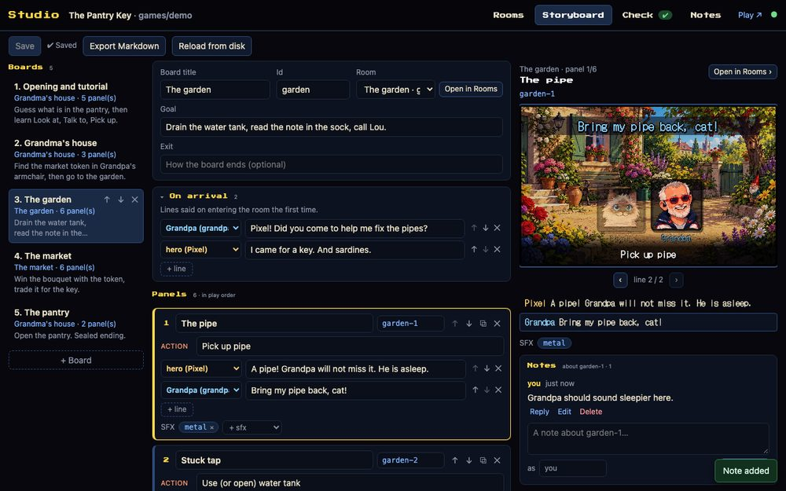 *The Studio, Storyboard tab: panels, lines, preview, notes* |
| 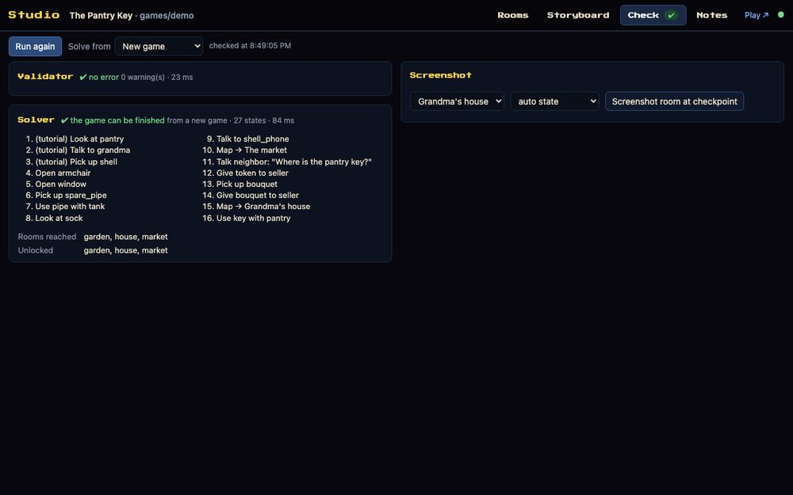 *The Studio, Check tab: validator, solver path, screenshots* | 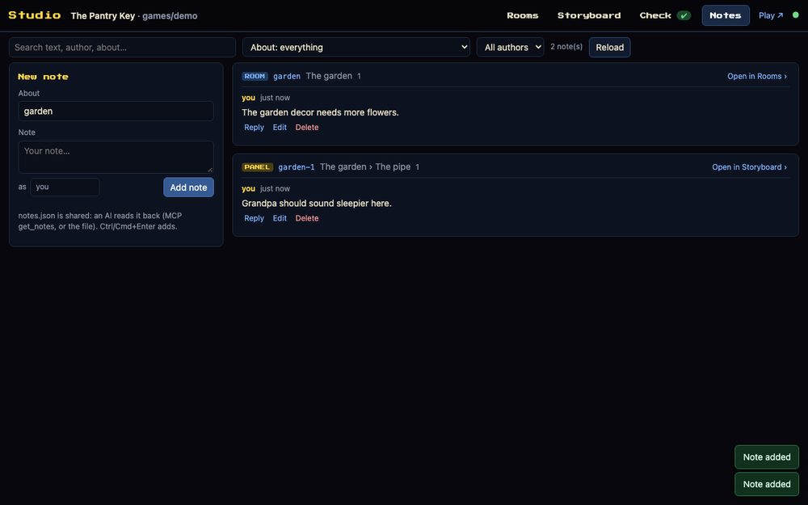 *The Studio, Notes tab: the shared log between you and the AI* |
| 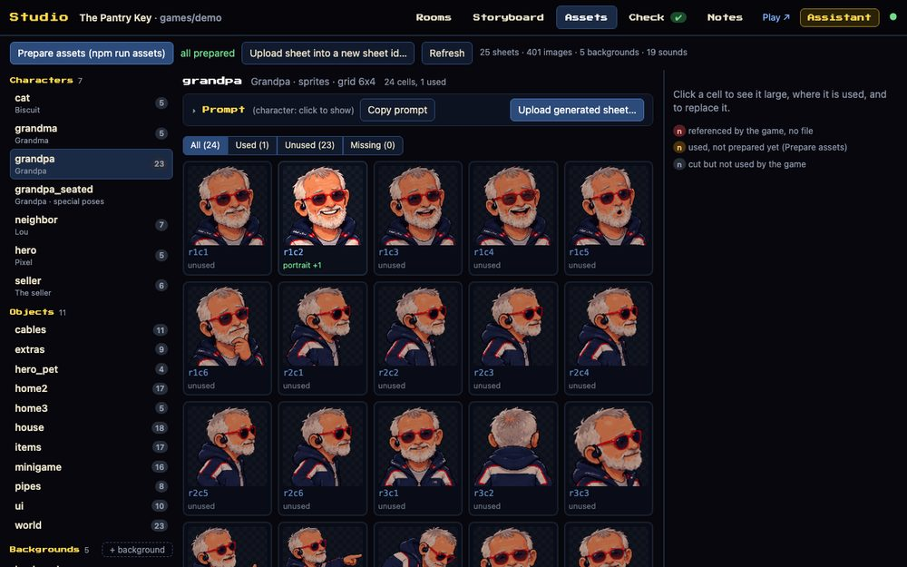 *The Studio, Assets tab: every sheet and cell, where it is used, the generation prompt, uploads* | 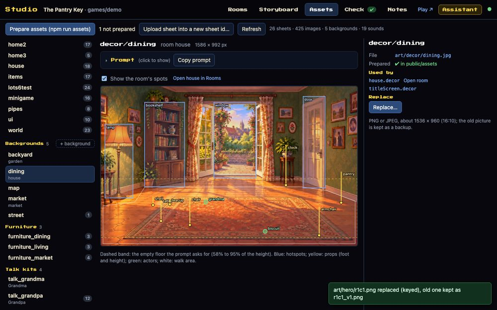 *A background with its hotspots, props and floor band overlaid* |
| 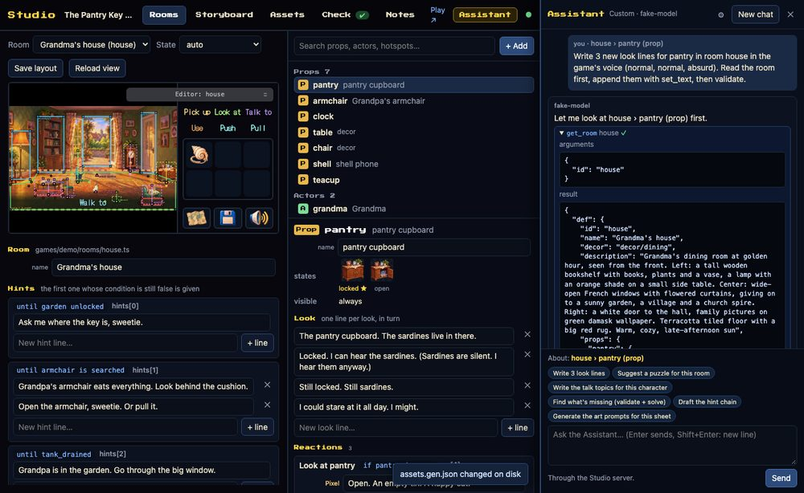 *The Assistant: any AI model, the same tools as the MCP server, about the selected element* | 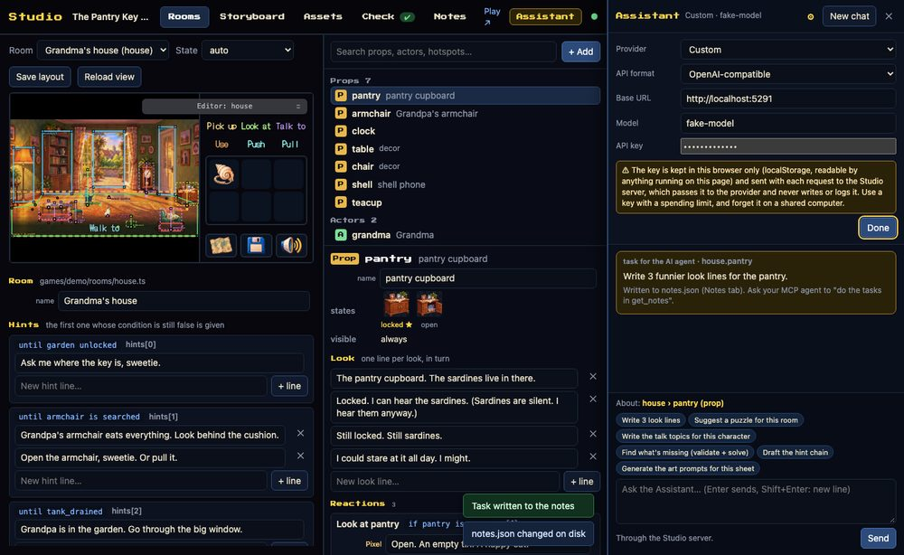 *Assistant settings: OpenAI, Anthropic, Mistral, Ollama or a custom endpoint, key kept in your browser* |

## Status
- Engine, tools and the sample game: complete and playable end to end (validator, solver, 154 tests, Playwright playthrough).
- Review pages (storyboard, sprite review, placement): working, as local HTML or as claude.ai artifacts.
- **Studio** (`npm run studio`): a complete local creation environment: rooms (WYSIWYG on the real engine), texts, storyboard, notes, **assets** (every image and sound, prompts per sheet, uploads cut automatically) and an **Assistant** that connects any AI model (OpenAI, Anthropic, Mistral, Ollama…) with the same tools as the MCP server. See `docs/en/STUDIO.md`.
- **Art prompts generator** (`npm run prompts`): ready-to-paste prompts for every character sheet (walk, talk, seated, the special poses your rooms use), object sheet with states, background and furniture, all sharing one style block. See `docs/en/PROMPTS.md`.
- **Colour discipline and pixel-art preset**: every generated prompt carries the colour rules (4 hue-shifted tones per material, flat areas, one outline); `artStyle: "pixel"` in `site.json` switches prompts, cutter (nearest-neighbour, shared palette, indexed PNG), pipeline (lossless) and rendering to true pixel art. **Palette swap** in the engine recolours a character or a variant from the same sprites.
- **Design guide** (`docs/en/DESIGN.md`): how to build a good SCUMM-style game with this engine, with a checklist before you share the link.
- **Studio** (v2.2): the **dialogue tree** of a character (topics, lines, choices, branches with their conditions) in the Rooms tab and as the MCP `dialogue_tree` tool, derived from the DSL; the engine's **journal** (what answered, events, script steps, moves, switches) in the Play tab and the dev panel.
- **Proof** (v2.1): **the classics** (`docs/en/CLASSICS.md`: twenty famous mechanics written with the DSL, five played and proven in the tests); the **puzzle graph** (what every rule needs and changes, a card per item / flag: Studio Check, `npm run page:puzzles`, MCP `puzzle_graph`); a **solver** that tries every reply of a choice, keeps counters that go down exact, plays scripts one wait at a time and leaves out what cannot matter; a **generated stress game** (`npm run bench`, `docs/en/BENCH.md`); one **catalogue of the commands** checked by `tsc`; loops with frame sounds; translations that follow a moved text.
- **Open** (v2.0): **custom commands** (`commands` in `index.ts`: declared `effects` for the solver, a `run` for the browser); **translations by extraction** (`npm run i18n`, `locales/<lang>.json`, a Language setting); the Studio's **Play tab** (the game beside its live state and a rule explainer: why this action answers that); micro-game fixtures per primitive in `tests/fixtures/`.
- **Cast** (v1.6): **several playable characters** (`players`): each with their own room, position and bag; switch buttons in the tools row, `{ switchPlayer }`, `{ transfer }`, condition `{ player }`; giving an item to an inactive character hands it over; the solver switches like the player. Demo: Biscuit is playable.
- **Picture** (v1.5): **wide rooms** (`width` in the layout) with a **camera** that follows the hero and `camera` commands (pan, centre on something); **prop animations with frame events** (`anims`, `{ play }`, `at: { frame: [commands] }`, also on character `anim`); **voice clips** on lines (`audio.voices`, `say.voice`); a **Settings** menu (text speed and size, reduce motion, readable font, music / sound / voice volumes).
- **Scale** (v1.4): **declared exits** (`exits`: a hotspot and its goto rule, generated) and the **world map** the tools draw from them (unreachable rooms, exits with no way back; Studio Check, `npm run page:world`); **chapters** (`goals` on checkpoints, `npm run solve -- --chapters`) and **invariants**; **save slots** with export / import and **data-only migrations** between `saveVersion`s; a **content profiler** (`npm run validate -- --report`, Studio, MCP `content_report`).
- **The world lives** (v1.3): **scripts** that run on their own between the player's actions (an NPC strolling, an ambient gag, `loop` / `while` / `waitUntil` / `waitEvent`), **events** (`{ emit }` and `events` listeners, room then game) and **moving characters** (`room` + `moveActor`, `{ actorIn }` condition). All data: saved with the game, checked by the validator, played by the solver. See "The world lives" in `docs/en/CONTENT_GUIDE.md`; the roadmap to a LucasArts-scale engine is in `docs/en/ROADMAP.md`.
- Try the Studio in your browser: https://wanoo.github.io/web-scumm/studio.html (demo mode, edits stay in your browser).
- **MCP server** (`npm run -s mcp`): the same operations as tools for Claude Code, Cursor, Codex, Gemini CLI or any MCP client. See `docs/en/MCP.md`.
- Next: adding and removing talk topics and reactions from the Studio, playing sound effects in the storyboard preview.

## What you get
- **An engine** (`src/engine`, TypeScript, no framework): 9 classic verbs, inventory, dialogue with transcript, hints,
  a world map with vehicles, cutscenes, two-voice phone calls, minigames (pipes, cable tangle, pick, hide and seek,
  runner, petting, scratch ticket), an optional **sealed ending** (AES-encrypted, revealed in play), save/continue,
  touch and mouse, phone and desktop layouts, service worker cache.
- **A content format** that is pure data: rooms, props with states, actors, rules (`verb` + target + condition +
  commands), talk topics, hints. No functions, so the tools can check it.
- **Tools**: a validator, a solver that proves the game finishes, an in-browser placement editor, an asset pipeline
  (AI-generated sheets → cut sprites → webp), a mouth-animation kit, phone-friendly review pages (storyboard, sprite
  review, drag-and-drop placement) that publish as claude.ai artifacts, a Playwright playthrough with screenshots.
- **A workflow for working with an AI assistant** (`docs/en/WORKFLOW.md`), a `CLAUDE.md`, skills for Claude Code,
  and a production-plan template for parallel sub-agents.

## Quick start
Needs Node 22+, Python 3 with `pip install -r requirements.txt` (Pillow, NumPy, SciPy for the sprite tools) and ffmpeg for sounds.
```bash
npm install
npm run dev                  # open the URL on your phone (same Wi-Fi), hold it in landscape
npm run studio               # the Studio at /__studio/: rooms WYSIWYG, texts, storyboard, notes, checks (local)
npm run -s mcp               # MCP server (stdio) exposing the same operations to any AI client
npm run validate             # content checks
npm run solve                # proves the game can be finished, prints the path
npm test                     # engine tests + the sample game's walkthrough
npm run build                # type-check, tests, bundle, spoiler check, leak audit → dist/
```

Make your own game:
```bash
npm run new-game my-game "My Game"   # games/my-game from the template, set as current game
npm run assets                       # prepare the placeholder art
npm run dev                          # ?edit=start to place things, ?dev&at=start to jump to a checkpoint
```
Then read `docs/en/CONTENT_GUIDE.md` and write `games/my-game/rooms/*.ts`. The story goes in `storyboard.json`
first; `docs/en/WORKFLOW.md` explains the whole method, `docs/en/PROMPTS.md` how to generate consistent art.

## Repository map
```
src/engine/      core (DSL, engine, solver, validator), dom (renderer), minigames, ending, dev (editor)
games/demo/      the sample game: game.ts, rooms/, layout/, art/, audio/, storyboard.json, site.json
games/_template/ copied by npm run new-game
tools/           validate, solve, refs, assets.py, cut-sheet.py, talk-*.py, pages/, audit-assets
scripts/         e2e harness, seal (sealed ending), gen-icons, new-game
docs/en docs/fr  ENGINE, CONTENT_GUIDE, DESIGN (design guide), CLASSICS (famous mechanics, written with the DSL), TOOLS, WORKFLOW, PROMPTS, PAGES, PRODUCTION.template
```

## Deploy
`npm run build` produces a static `dist/`. The CI workflow deploys it to GitHub Pages on every push to `main`.
Any static host works (Clever Cloud, Netlify, a plain nginx). `GAME=<id> npm run build` builds another game.
With `STUDIO=1 VITE_STUDIO_DEMO=1` (what the CI does, or `npm run build:studio-demo`), `dist/` also holds the Studio in
demo mode at `studio.html` (see `docs/en/STUDIO.md`, "Demo mode"); the game itself is unchanged.

## Licences
Code: MIT. Sample artwork: CC BY 4.0 (attribution "Wano"). Sound effects: Kenney, CC0. Fonts: SIL OFL. See `CREDITS.md`.
